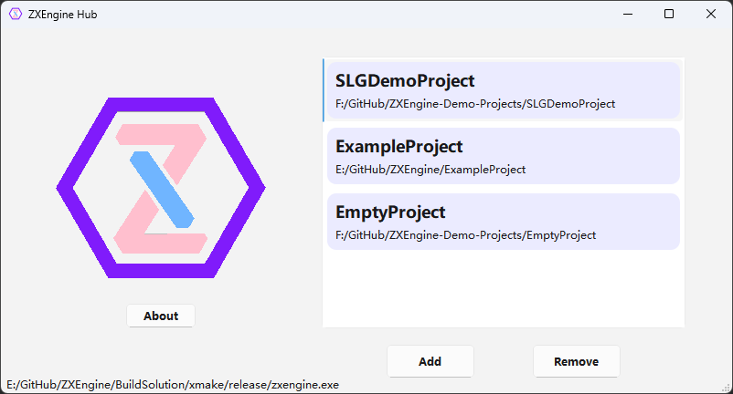
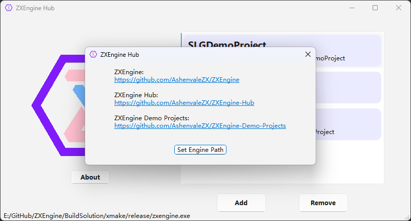

# ZXEngine-Hub
这是一个用于管理ZXEngine项目的桌面软件，使用Qt开发，支持Qt所支持的所有桌面平台。

This is a desktop software for managing ZXEngine projects, developed using Qt and supports all desktop platforms supported by Qt.

## 使用说明 (Instructions)

第一次使用前需要先点击About按钮，然后点击Set Engine Path按钮，设置当前引擎的安装路径(或者编译输出路径)。

Before using the ZXEngine Hub for the first time, you need to click the "About" button and then click the "Set Engine Path" button to set the installation path(or compile output path) of the ZXEngine.

然后点击Add按钮添加本地的ZXEngine项目，添加后项目会出现在右边的项目列表中。双击一个项目就会用ZXEngine启动该项目。如果不需要某个项目了，可以单击选中该项目，然后点击Remove按钮将其移除即可，此移除操作不会删除本地项目文件。

Then click the "Add" button to add the local ZXEngine project. After adding, the project will appear in the project list on the right. Double-clicking a project will start the project with ZXEngine. If a project is no longer needed, you can click to select the project and then click the "Remove" button to remove it. The remove operation will not delete the local project file.

